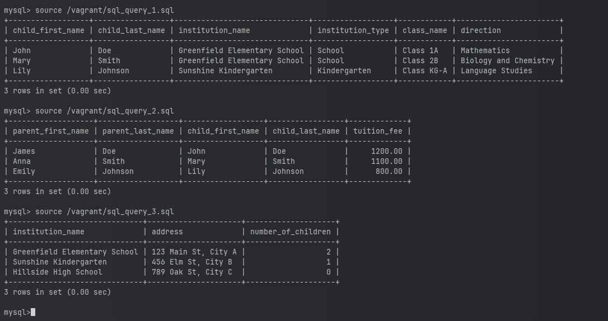
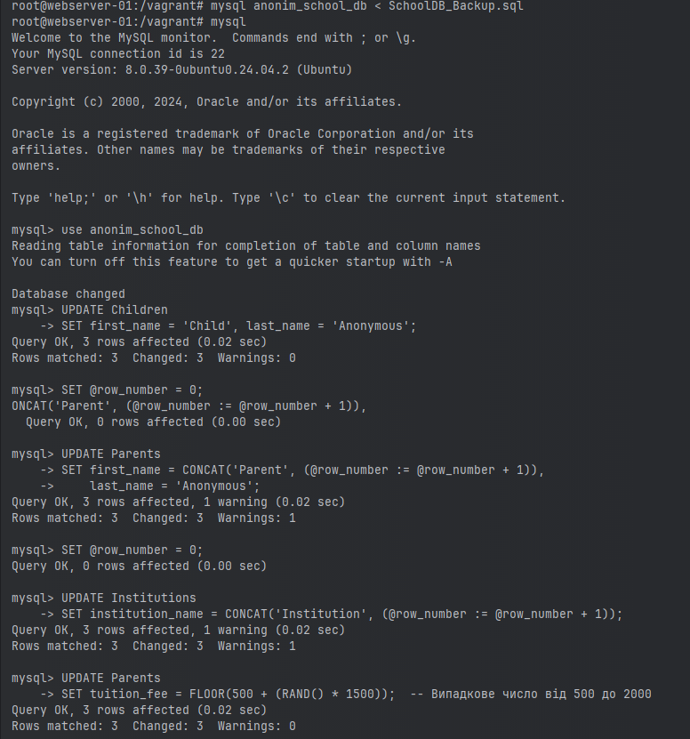
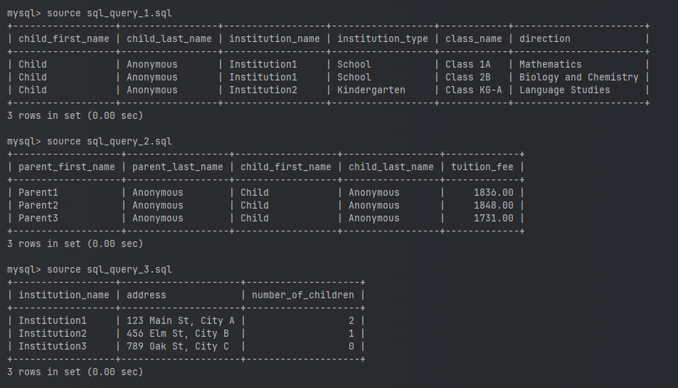

# LECTURE 13: Створення та анонімізація бази даних SchoolDB

---

## Опис

Цей проект передбачає створення бази даних, що містить інформацію про навчальні заклади, класи, дітей, та їх батьків. Основні етапи проекту включають:
1. Створення бази даних та таблиць.
2. Вставка реалістичних даних.
3. Виконання SQL-запитів для отримання інформації.
4. Створення бекапу бази даних та її відновлення для нової бази даних.
5. Анонімізація даних у таблицях.
6. Перевірка цілісності даних після анонімізації.

## Кроки виконання

### 1. Створення бази даних

Команда для створення бази даних:

```sql
CREATE DATABASE SchoolDB;
USE SchoolDB;
```

### 2. Створення таблиці Institutions

Таблиця `Institutions` зберігає інформацію про навчальні заклади. Використано наступну SQL-команду для створення:

```sql
CREATE TABLE Institutions (
    institution_id INT AUTO_INCREMENT PRIMARY KEY,
    institution_name VARCHAR(255) NOT NULL,
    institution_type ENUM('School', 'Kindergarten') NOT NULL,
    address VARCHAR(255) NOT NULL
);
```

### 3. Створення таблиці Classes

Таблиця `Classes` зберігає інформацію про класи:

```sql
CREATE TABLE Classes (
    class_id INT AUTO_INCREMENT PRIMARY KEY,
    class_name VARCHAR(255) NOT NULL,
    institution_id INT,
    direction ENUM('Mathematics', 'Biology and Chemistry', 'Language Studies') NOT NULL,
    FOREIGN KEY (institution_id) REFERENCES Institutions(institution_id)
);
```

### 4. Створення таблиці Children

Таблиця `Children` зберігає інформацію про дітей:

```sql
CREATE TABLE Children (
    child_id INT AUTO_INCREMENT PRIMARY KEY,
    first_name VARCHAR(255) NOT NULL,
    last_name VARCHAR(255) NOT NULL,
    birth_date DATE NOT NULL,
    year_of_entry YEAR NOT NULL,
    age INT NOT NULL,
    institution_id INT,
    class_id INT,
    FOREIGN KEY (institution_id) REFERENCES Institutions(institution_id),
    FOREIGN KEY (class_id) REFERENCES Classes(class_id)
);
```

### 5. Створення таблиці Parents

Таблиця `Parents` зберігає інформацію про батьків:

```sql
CREATE TABLE Parents (
    parent_id INT AUTO_INCREMENT PRIMARY KEY,
    first_name VARCHAR(255) NOT NULL,
    last_name VARCHAR(255) NOT NULL,
    child_id INT,
    tuition_fee DECIMAL(10, 2) NOT NULL,
    FOREIGN KEY (child_id) REFERENCES Children(child_id)
);
```

### 6. Вставка даних

Для кожної таблиці було вставлено мінімум по три записи для імітації реальних даних:

```sql
-- Вставка даних у таблицю Institutions
INSERT INTO Institutions (institution_name, institution_type, address)
VALUES 
('Greenfield Elementary School', 'School', '123 Main St, City A'),
('Sunshine Kindergarten', 'Kindergarten', '456 Elm St, City B'),
('Hillside High School', 'School', '789 Oak St, City C');
```

(Додати скріншот з результатами після виконання команд)

### 7. Виконання SQL-запитів

1. **Запит для отримання списку дітей разом із закладом та напрямом навчання:**

   ```sql
   SELECT 
       Children.first_name AS child_first_name,
       Children.last_name AS child_last_name,
       Institutions.institution_name,
       Institutions.institution_type,
       Classes.class_name,
       Classes.direction
   FROM 
       Children
   JOIN 
       Institutions ON Children.institution_id = Institutions.institution_id
   JOIN 
       Classes ON Children.class_id = Classes.class_id;
   ```


2. **Запит для отримання інформації про батьків та вартість навчання:**

   ```sql
   SELECT 
       Parents.first_name AS parent_first_name,
       Parents.last_name AS parent_last_name,
       Children.first_name AS child_first_name,
       Children.last_name AS child_last_name,
       Parents.tuition_fee
   FROM 
       Parents
   JOIN 
       Children ON Parents.child_id = Children.child_id;
   ```

3. **Запит для отримання кількості дітей у кожному закладі:**

   ```sql
   SELECT 
       Institutions.institution_name,
       Institutions.address,
       COUNT(Children.child_id) AS number_of_children
   FROM 
       Institutions
   LEFT JOIN 
       Children ON Institutions.institution_id = Children.institution_id
   GROUP BY 
       Institutions.institution_name, Institutions.address;
   ```

   

### 8. Створення бекапу та відновлення бази даних

1. **Створення бекапу бази даних:**

   ```bash
   mysqldump -u username -p SchoolDB > SchoolDB_Backup.sql
   ```

2. **Створення нової бази для відновлення та виконання анонімізації:**

   ```sql
   CREATE DATABASE anonim_school_bd;
   ```

3. **Відновлення даних у нову базу:**

   ```bash
   mysql -u username -p anonim_school_bd < SchoolDB_Backup.sql
   ```

### 9. Анонімізація даних

1. **Анонімізація таблиці Children:**

   ```sql
   UPDATE Children
   SET first_name = 'Child', last_name = 'Anonymous';
   ```

2. **Анонімізація таблиці Parents:**

   ```sql
   SET @row_number = 0;
   UPDATE Parents
   SET first_name = CONCAT('Parent', (@row_number := @row_number + 1)), 
       last_name = 'Anonymous';
   ```

3. **Анонімізація таблиці Institutions:**

   ```sql
   SET @row_number = 0;
   UPDATE Institutions
   SET institution_name = CONCAT('Institution', (@row_number := @row_number + 1));
   ```

4. **Анонімізація вартості навчання (tuition_fee):**

   ```sql
   UPDATE Parents
   SET tuition_fee = FLOOR(500 + (RAND() * 1500));
   ```
   

### 10. Перевірка результатів анонімізації

Для перевірки результатів анонімізації, виконайте такі запити:

```sql
-- Перевірка таблиці Children
SELECT first_name, last_name FROM Children LIMIT 5;

-- Перевірка таблиці Parents
SELECT first_name, last_name, tuition_fee FROM Parents LIMIT 5;

-- Перевірка таблиці Institutions
SELECT institution_name FROM Institutions LIMIT 5;
```



---