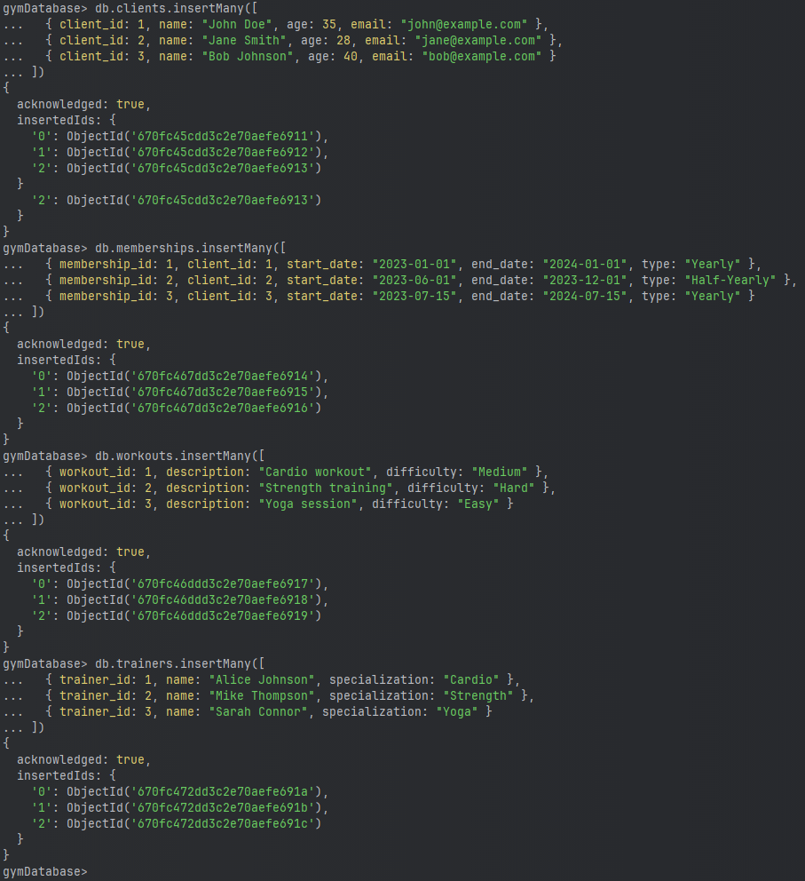

# MongoDB Gym Database

## Create the Gym Database

1. **Switch to the `gymDatabase`:**

   ```mongo
   use gymDatabase
   ```

2. **Create the necessary collections:**

   ```mongo
   db.createCollection("clients")
   db.createCollection("memberships")
   db.createCollection("workouts")
   db.createCollection("trainers")
   ```
   

## Define the Document Schemas and Insert Data

1. **Insert data into the `clients` collection:**

   ```mongo
   db.clients.insertMany([
     { client_id: 1, name: "John Doe", age: 35, email: "john@example.com" },
     { client_id: 2, name: "Jane Smith", age: 28, email: "jane@example.com" },
     { client_id: 3, name: "Bob Johnson", age: 40, email: "bob@example.com" }
   ])
   ```

2. **Insert data into the `memberships` collection:**

   ```mongo
   db.memberships.insertMany([
     { membership_id: 1, client_id: 1, start_date: "2023-01-01", end_date: "2024-01-01", type: "Yearly" },
     { membership_id: 2, client_id: 2, start_date: "2023-06-01", end_date: "2023-12-01", type: "Half-Yearly" },
     { membership_id: 3, client_id: 3, start_date: "2023-07-15", end_date: "2024-07-15", type: "Yearly" }
   ])
   ```

3. **Insert data into the `workouts` collection:**

   ```mongo
   db.workouts.insertMany([
     { workout_id: 1, description: "Cardio workout", difficulty: "Medium" },
     { workout_id: 2, description: "Strength training", difficulty: "Hard" },
     { workout_id: 3, description: "Yoga session", difficulty: "Easy" }
   ])
   ```

4. **Insert data into the `trainers` collection:**

   ```mongo
   db.trainers.insertMany([
     { trainer_id: 1, name: "Alice Johnson", specialization: "Cardio" },
     { trainer_id: 2, name: "Mike Thompson", specialization: "Strength" },
     { trainer_id: 3, name: "Sarah Connor", specialization: "Yoga" }
   ])
   ```
   

## Perform Basic Queries

1. **Find all clients older than 30 years:**

   ```mongo
   db.clients.find({ age: { $gt: 30 } })
   ```

2. **List all workouts with a "Medium" difficulty:**

   ```mongo
   db.workouts.find({ difficulty: "Medium" })
   ```

3. **Show membership information for a specific client (client_id = 1):**

   ```mongo
   db.memberships.find({ client_id: 1 })
   ```
   

