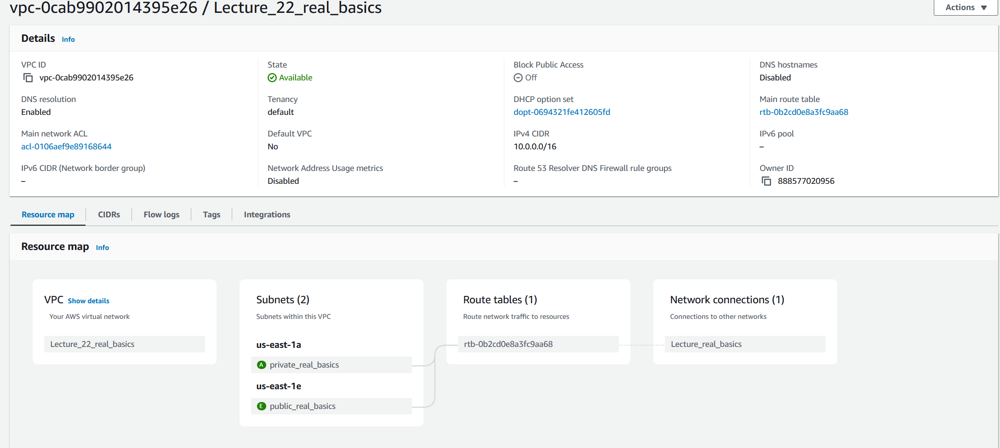
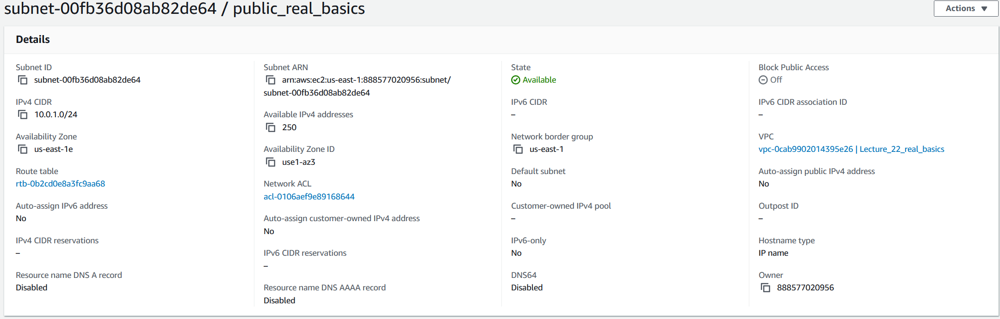
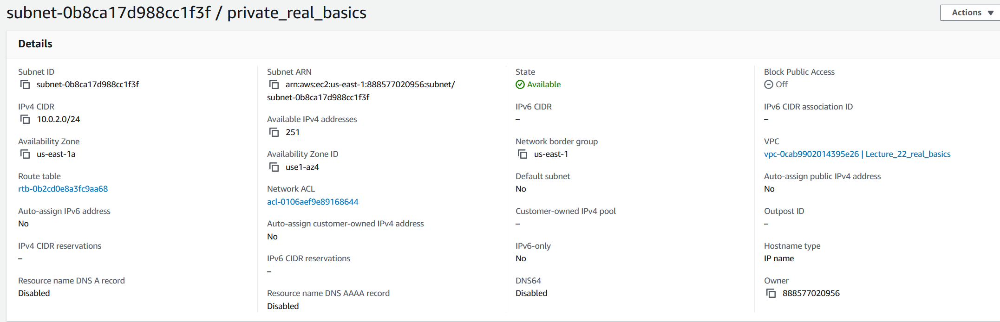
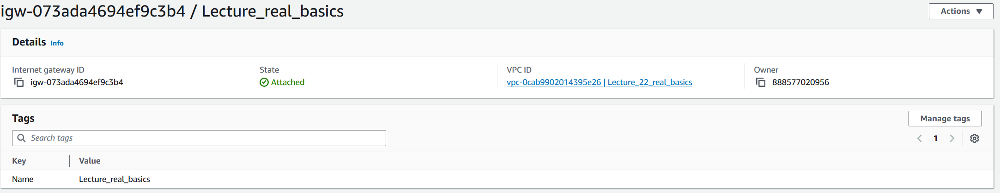
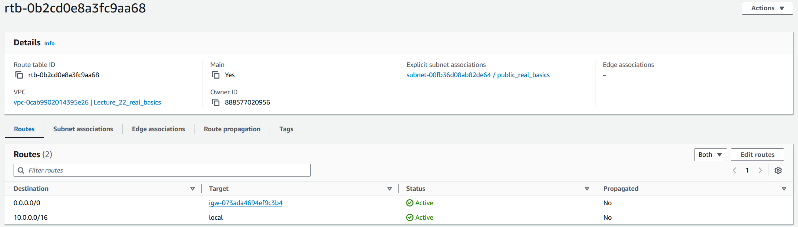
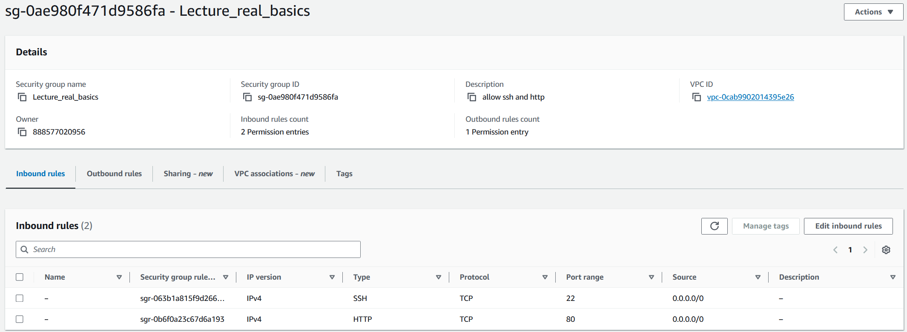
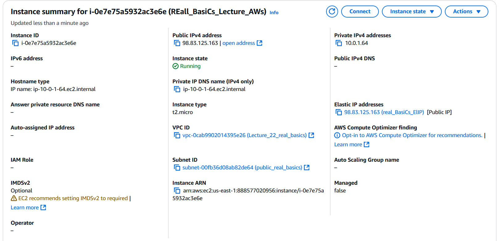
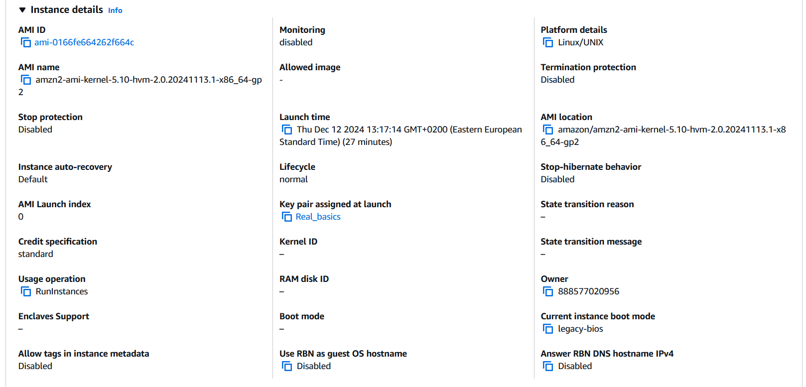
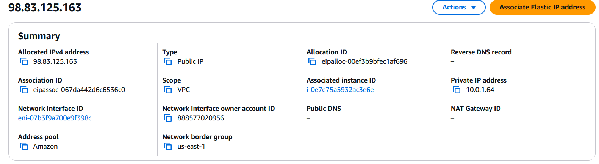
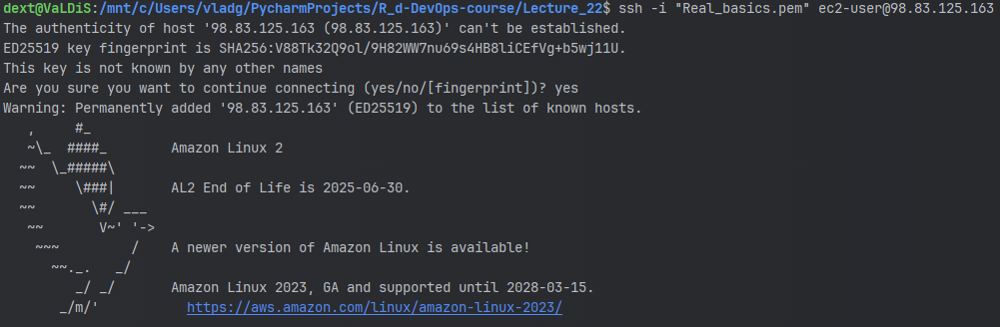

# AWS Basics real 

---

## **1. Створення та налаштування VPC**

### **1.1 Створення VPC**
1. **Увійдіть до AWS Management Console.**
2. Відкрийте сервіс **VPC** (через пошук у верхньому меню або список сервісів).
3. У меню зліва оберіть **Your VPCs** → натисніть кнопку **Create VPC**.
4. Заповніть поля:
   - **Name tag:** Введіть ім'я, наприклад, `MyFirstVPC`.
   - **IPv4 CIDR block:** Введіть CIDR-блок, наприклад, `10.0.0.0/16`.
   - Інші параметри залиште за замовчуванням.
5. Натисніть **Create VPC**.



### **1.2 Створення публічної підмережі**
1. У меню зліва оберіть **Subnets** → натисніть **Create Subnet**.
2. Заповніть поля:
   - **Name tag:** Введіть ім'я, наприклад, `PublicSubnet`.
   - **VPC ID:** Виберіть VPC, створену на попередньому кроці.
   - **Availability Zone:** Виберіть будь-яку (наприклад, `us-east-1a`).
   - **IPv4 CIDR block:** Введіть CIDR-блок, наприклад, `10.0.1.0/24`.
3. Натисніть **Create Subnet**.


### **1.3 Створення приватної підмережі**
1. У меню **Subnets** натисніть **Create Subnet** ще раз.
2. Заповніть поля:
   - **Name tag:** Введіть ім'я, наприклад, `PrivateSubnet`.
   - **VPC ID:** Виберіть ту ж VPC.
   - **Availability Zone:** Виберіть будь-яку (наприклад, `us-east-1b`).
   - **IPv4 CIDR block:** Введіть CIDR-блок, наприклад, `10.0.2.0/24`.
3. Натисніть **Create Subnet**.



---

### **1.4 Створення та прив’язка Internet Gateway**
1. У меню зліва оберіть **Internet Gateways** → натисніть **Create Internet Gateway**.
2. Заповніть поля:
   - **Name tag:** Введіть ім'я, наприклад, `MyIGW`.
3. Натисніть **Create Internet Gateway**.
4. Після створення натисніть **Actions** → **Attach to VPC** → виберіть вашу VPC → натисніть **Attach Internet Gateway**.



---

### **1.5 Налаштування таблиць маршрутизації**
1. У меню зліва оберіть **Route Tables** → знайдіть таблицю, прив’язану до вашої VPC (вона створюється автоматично).
2. Натисніть на таблицю → перейдіть до вкладки **Routes** → натисніть **Edit Routes**.
3. Додайте новий маршрут:
   - **Destination:** `0.0.0.0/0`.
   - **Target:** Виберіть ваш Internet Gateway.
4. Натисніть **Save Changes**.

5. У вкладці **Subnet associations** → натисніть **Edit subnet associations** → оберіть **PublicSubnet** → натисніть **Save associations**.
   


---

## **2. Налаштування груп безпеки**

### **2.1 Створення Security Group**
1. У меню зліва оберіть **Security Groups** → натисніть **Create Security Group**.
2. Заповніть поля:
   - **Name:** Введіть ім'я, наприклад, `MySecurityGroup`.
   - **Description:** Наприклад, `Allows HTTP and SSH traffic`.
   - **VPC:** Виберіть вашу VPC.
3. Натисніть **Create Security Group**.

### **2.2 Налаштування правил Security Group**
1. Знайдіть вашу групу у списку → натисніть на неї.
2. Перейдіть до вкладки **Inbound rules** → натисніть **Edit inbound rules**.
3. Додайте правила:
   - **Rule 1:**
     - **Type:** SSH.
     - **Protocol:** TCP.
     - **Port Range:** 22.
     - **Source:** Anywhere (`0.0.0.0/0`).
   - **Rule 2:**
     - **Type:** HTTP.
     - **Protocol:** TCP.
     - **Port Range:** 80.
     - **Source:** Anywhere (`0.0.0.0/0`).
4. Натисніть **Save rules**.



---

## **3. Запуск інстансу EC2**

### **3.1 Створення інстансу**
1. Відкрийте сервіс **EC2** у консолі AWS.
2. Натисніть **Launch Instances**.
3. Заповніть поля:
   - **Name:** Введіть ім'я, наприклад, `MyEC2Instance`.
   - **AMI:** Виберіть **Amazon Linux 2 AMI**.
   - **Instance type:** Виберіть **t2.micro** (безкоштовний).
   - **Key pair:** Створіть новий SSH-ключ або використайте існуючий.
     - Якщо створюєте новий ключ, завантажте його.
   - **Network settings:**
     - **VPC:** Виберіть вашу VPC.
     - **Subnet:** Виберіть **PublicSubnet**.
     - **Auto-assign Public IP:** Увімкніть.
     - **Security group:** Виберіть **MySecurityGroup**.
4. Натисніть **Launch Instance**.






---

## **4. Призначення еластичної IP-адреси (EIP)**

### **4.1 Створення та прив’язка EIP**
1. У меню **Elastic IPs** натисніть **Allocate Elastic IP address**.
2. Натисніть **Allocate**.
3. Знайдіть створену EIP у списку → натисніть **Actions** → **Associate Elastic IP address**.
4. У полі **Instance** виберіть ваш EC2 інстанс.
5. Натисніть **Associate**.



---

### **5. Підключення до інстансу**
1. Використайте SSH для підключення:
   ```bash
   ssh -i "your-key.pem" ec2-user@your-elastic-ip
   ```
   - Замініть `"your-key.pem"` на шлях до вашого ключа.
   - Замініть `your-elastic-ip` на EIP інстансу.



---
