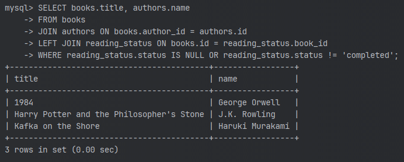
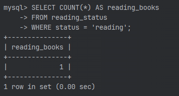
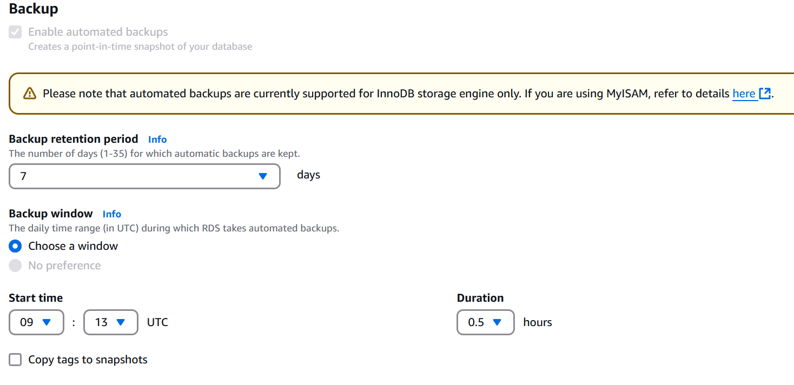
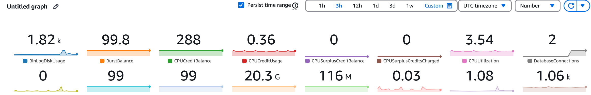

# AWS DB cervice

### Створення VPC та базиданних для нього
Є два скрипти, один створює VPC за всіма вимогами для бази данних 
[create-vpc.sh](create-vpc.sh)
Та інший який створює та деплоїть RDS - instance з базою данних бібліотеки
[deploy-library-rds.sh](deploy-library-rds.sh)

Після Створення можна зіткнутися з проблемами підключення до БД проте, я створив EC2 в публічній мережі щоб підключатися
до нашої БД. Якби БД знаходилась в публічній мережі, то другий скрипт виконався б докінця.

Тоді я виконав команди для створення таблиць і наповнив даними.

### Виконав запити:

### Увікнув автоматичне резервне копіювання у налаштуваннях RDS

### Метрики мого інстансу в CloudWatch 

