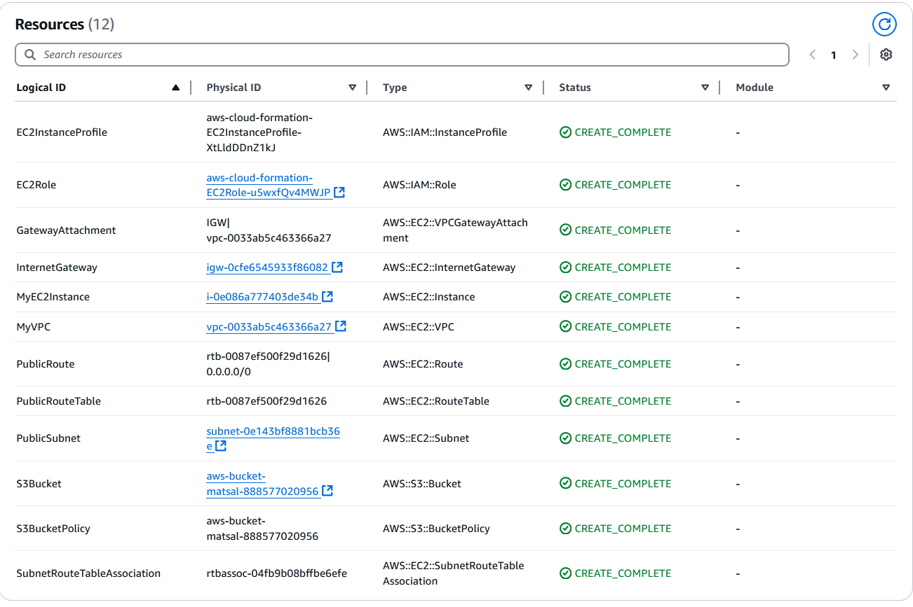
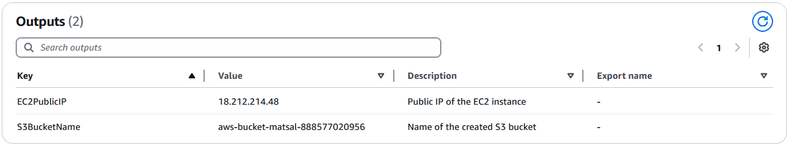
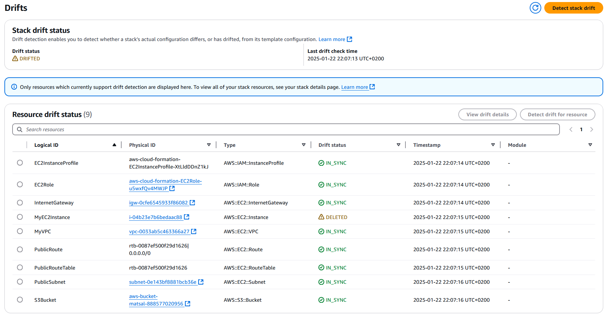

# AWS CloudFormation

### Створив інфраструктуру за допомоги CloudFormation відповідно завдання 

Код знаходиться у файлі [tamplate.yaml](tamplate.yaml)

### Результати

#### Створені ресурси:

#### Вивід:

#### Вручну видали інстанс і перевірив інфраструктуру на DRIFT

