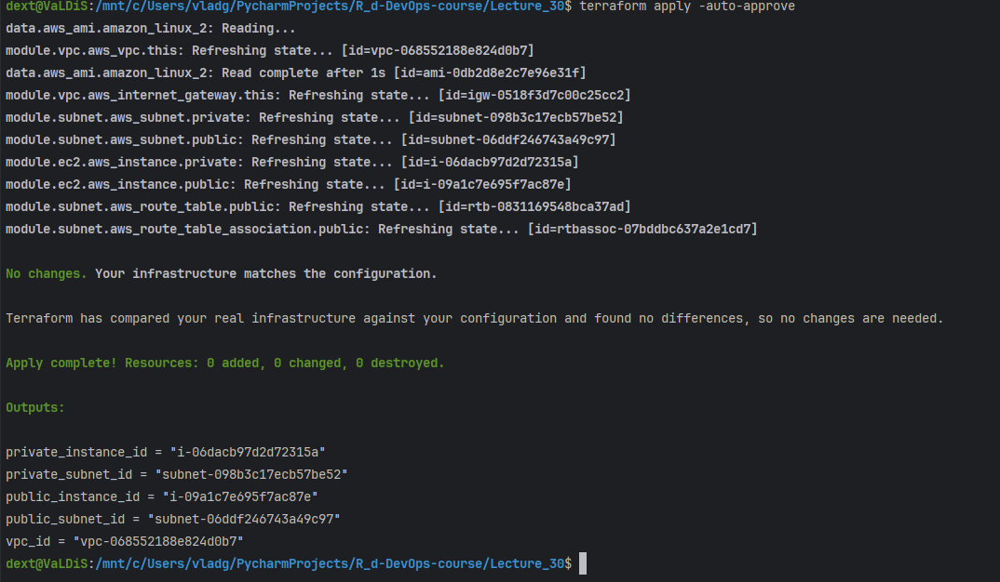
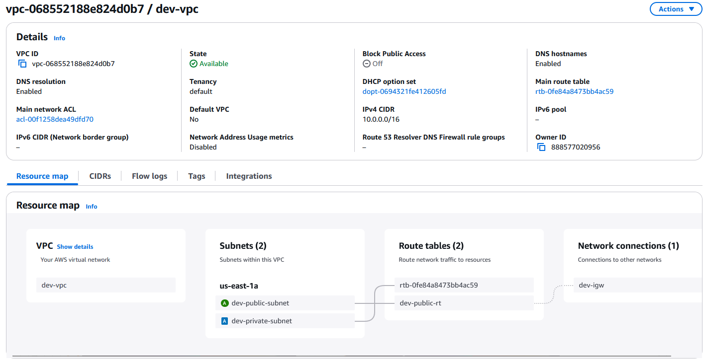

# Terraform Homework

Для виконання цього завдання ми створимо інфраструктуру за допомогою Terraform, використовуючи модулі для VPC, підмереж та EC2-інстансів. Ми розділимо код на окремі файли, щоб він був структурований і зрозумілий. Також ми опишемо всі змінні, які будуть використовуватися, і додамо теги для подальшого управління інфраструктурою за допомогою Ansible.

### Структура проекту

```
terraform/
│
├── main.tf
├── variables.tf
├── outputs.tf
├── modules/
│   ├── vpc/
│   │   ├── main.tf
│   │   ├── variables.tf
│   │   └── outputs.tf
│   ├── subnet/
│   │   ├── main.tf
│   │   ├── variables.tf
│   │   └── outputs.tf
│   └── ec2/
│       ├── main.tf
│       ├── variables.tf
│       └── outputs.tf
└── terraform.tfvars
```

### Крок 1: Створення модуля для VPC

#### `modules/vpc/main.tf`

```hcl
resource "aws_vpc" "this" {
  cidr_block           = var.vpc_cidr
  enable_dns_support   = true
  enable_dns_hostnames = true

  tags = {
    Name = "${var.env}-vpc"
  }
}

resource "aws_internet_gateway" "this" {
  vpc_id = aws_vpc.this.id

  tags = {
    Name = "${var.env}-igw"
  }
}
```

#### `modules/vpc/variables.tf`

```hcl
variable "vpc_cidr" {
  description = "CIDR block for the VPC"
  type        = string
}

variable "env" {
  description = "Environment name"
  type        = string
}
```

#### `modules/vpc/outputs.tf`

```hcl
output "vpc_id" {
  value = aws_vpc.this.id
}

output "igw_id" {
  value = aws_internet_gateway.this.id
}
```

### Крок 2: Створення модуля для підмереж

#### `modules/subnet/main.tf`

```hcl
resource "aws_subnet" "public" {
  vpc_id            = var.vpc_id
  cidr_block        = var.public_subnet_cidr
  availability_zone = var.az

  tags = {
    Name = "${var.env}-public-subnet"
  }
}

resource "aws_subnet" "private" {
  vpc_id            = var.vpc_id
  cidr_block        = var.private_subnet_cidr
  availability_zone = var.az

  tags = {
    Name = "${var.env}-private-subnet"
  }
}

resource "aws_route_table" "public" {
  vpc_id = var.vpc_id

  route {
    cidr_block = "0.0.0.0/0"
    gateway_id = var.igw_id
  }

  tags = {
    Name = "${var.env}-public-rt"
  }
}

resource "aws_route_table_association" "public" {
  subnet_id      = aws_subnet.public.id
  route_table_id = aws_route_table.public.id
}
```

#### `modules/subnet/variables.tf`

```hcl
variable "vpc_id" {
  description = "VPC ID"
  type        = string
}

variable "public_subnet_cidr" {
  description = "CIDR block for the public subnet"
  type        = string
}

variable "private_subnet_cidr" {
  description = "CIDR block for the private subnet"
  type        = string
}

variable "az" {
  description = "Availability Zone"
  type        = string
}

variable "igw_id" {
  description = "Internet Gateway ID"
  type        = string
}

variable "env" {
  description = "Environment name"
  type        = string
}
```

#### `modules/subnet/outputs.tf`

```hcl
output "public_subnet_id" {
  value = aws_subnet.public.id
}

output "private_subnet_id" {
  value = aws_subnet.private.id
}
```

### Крок 3: Створення модуля для EC2-інстансів

#### `modules/ec2/main.tf`

```hcl
resource "aws_instance" "public" {
  ami           = var.ami_id
  instance_type = var.instance_type
  subnet_id     = var.public_subnet_id

  tags = {
    Name = "${var.env}-public-instance"
  }
}

resource "aws_instance" "private" {
  ami           = var.ami_id
  instance_type = var.instance_type
  subnet_id     = var.private_subnet_id

  tags = {
    Name = "${var.env}-private-instance"
  }
}
```

#### `modules/ec2/variables.tf`

```hcl
variable "ami_id" {
  description = "AMI ID for the EC2 instance"
  type        = string
}

variable "instance_type" {
  description = "Instance type for the EC2 instance"
  type        = string
}

variable "public_subnet_id" {
  description = "Public Subnet ID"
  type        = string
}

variable "private_subnet_id" {
  description = "Private Subnet ID"
  type        = string
}

variable "env" {
  description = "Environment name"
  type        = string
}
```

#### `modules/ec2/outputs.tf`

```hcl
output "public_instance_id" {
  value = aws_instance.public.id
}

output "private_instance_id" {
  value = aws_instance.private.id
}
```

### Крок 4: Основна конфігурація Terraform

#### `main.tf`

```hcl
provider "aws" {
  region = var.region
}

module "vpc" {
  source = "./modules/vpc"

  vpc_cidr = var.vpc_cidr
  env      = var.env
}

module "subnet" {
  source = "./modules/subnet"

  vpc_id             = module.vpc.vpc_id
  public_subnet_cidr = var.public_subnet_cidr
  private_subnet_cidr = var.private_subnet_cidr
  az                 = var.az
  igw_id             = module.vpc.igw_id
  env                = var.env
}

module "ec2" {
  source = "./modules/ec2"

  ami_id           = var.ami_id
  instance_type    = var.instance_type
  public_subnet_id = module.subnet.public_subnet_id
  private_subnet_id = module.subnet.private_subnet_id
  env              = var.env
}
```

#### `variables.tf`

```hcl
variable "region" {
  description = "AWS region"
  type        = string
}

variable "vpc_cidr" {
  description = "CIDR block for the VPC"
  type        = string
}

variable "public_subnet_cidr" {
  description = "CIDR block for the public subnet"
  type        = string
}

variable "private_subnet_cidr" {
  description = "CIDR block for the private subnet"
  type        = string
}

variable "az" {
  description = "Availability Zone"
  type        = string
}

variable "ami_id" {
  description = "AMI ID for the EC2 instance"
  type        = string
}

variable "instance_type" {
  description = "Instance type for the EC2 instance"
  type        = string
}

variable "env" {
  description = "Environment name"
  type        = string
}
```

#### `outputs.tf`

```hcl
output "vpc_id" {
  value = module.vpc.vpc_id
}

output "public_subnet_id" {
  value = module.subnet.public_subnet_id
}

output "private_subnet_id" {
  value = module.subnet.private_subnet_id
}

output "public_instance_id" {
  value = module.ec2.public_instance_id
}

output "private_instance_id" {
  value = module.ec2.private_instance_id
}
```

#### `terraform.tfvars`

```hcl
region              = "us-east-1"
vpc_cidr            = "10.0.0.0/16"
public_subnet_cidr  = "10.0.1.0/24"
private_subnet_cidr = "10.0.2.0/24"
az                  = "us-east-1a"
ami_id              = "ami-0e2c8caa4b6378d8c" 
instance_type       = "t2.micro"
env                 = "dev"
```

### Крок 5: Ініціалізація та застосування конфігурації

1. **Ініціалізація Terraform:**

   ```bash
   terraform init
   ```

2. **Перевірка конфігурації:**

   ```bash
   terraform plan
   ```

3. **Застосування конфігурації:**

   ```bash
   terraform apply
   ```
### Результат 





   Після виконання цієї команди Terraform створить VPC, підмережі та EC2-інстанси згідно з нашої конфігурацією.
### Проблеми з якими зіткнувся

   - не підходив AMI для регіону
   - не підходили права доступу адміна виявляється я просто додав на якомусь етапі правила які забороняли дії з EC2 
   - 

### Висновок

Ми створили інфраструктуру за допомогою Terraform, використовуючи модулі для VPC, підмереж та EC2-інстансів. Код був розділений на окремі файли для кращої структуризації та зрозумілості. Ми також додали теги для подальшого управління інфраструктурою за допомогою Ansible. Тепер ви можете легко повторити цей процес і налаштувати свою інфраструктуру.